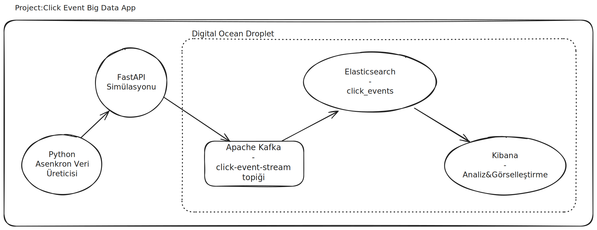

# Click Event Big Data App

*Bu proje,  bir web uygulamasından gelen kullanıcı etkileşim (click event) verilerini simüle ederek toplayan, Apache Kafka ile taşıyan, Elasticsearch'e yükleyen ve Kibana ile görselleştiren, uçtan uca, yüksek performanslı ve sağlam (robust) bir veri mühendisliği çalışmasıdır.*

-----

## 1\. Projenin Amacı ve İş Problemi

Dijital platformlarda, kullanıcıların her bir tıklaması ve etkileşimi, iş kararlarını yönlendirecek değerli birer veri noktasıdır. Bu projenin amacı, bu yüksek hacimli ve anlık veri akışını yönetebilecek, ölçeklenebilir bir altyapı kurmaktır.

## 2\. Sistem Mimarisi ve Veri Akışı

1.  **API / Webservice (Veri Toplama):** `FastAPI` ve `Pydantic` kullanılarak geliştirilen bu asenkron Python servisi, dış dünyadan gelen click event JSON verilerini karşılar. Pydantic ile gelen veriyi anında doğrular, böylece sisteme sadece temiz ve yapısal verinin girmesi garanti altına alınır.
2.  **Apache Kafka (Veri Taşıma):** API'den gelen doğrulanmış veriler, bir "şok emici" ve "tampon" görevi gören Kafka'daki `click-events` topic'ine anlık olarak gönderilir. Bu, API'yi yavaşlatmadan ve veri kaybı riski olmadan, saniyede binlerce olayın güvenle alınmasını sağlar.
3.  **Consumer Job (Veri Tüketme ve Yükleme):** `kafka-python` ve `elasticsearch-py` kütüphanelerini kullanan, sürekli çalışan (long-running) bir Python servisi, Kafka'yı dinler. Gelen mesajları toplu halde (batch) alarak, analiz için optimize edilmiş olan Elasticsearch'e verimli bir şekilde yazar.
4.  **Elasticsearch (İndeksleme ve Analiz):** Yüklenen click event verileri, Elasticsearch tarafından anlık olarak indekslenir. Bu, milyonlarca kayıt arasında milisaniyeler içinde arama, filtreleme ve agregasyon yapılmasına olanak tanır.
5.  **Kibana (Görselleştirme):** Elasticsearch'teki bu veriler, Kibana üzerinde oluşturulan interaktif dashboard'lar, huni analizleri ve kullanıcı yolculuğu haritaları ile görselleştirilerek, iş birimlerinin anlayabileceği anlamlı bilgilere dönüştürülür.

## 3\. Kullanılan Teknolojiler

  * **Veri Akışı ve Mesajlaşma:** Apache Kafka (KRaft Modu)
  * **Veri Depolama ve Arama Motoru:** Elasticsearch 8.x
  * **Veri Görselleştirme ve Dashboard:** Kibana 8.x
  * **API Servisi ve Veri Üretimi:** Python, FastAPI, Pydantic, `httpx`, `asyncio`
  * **Consumer Servisi:** Python, `kafka-python`, `elasticsearch-py`
  * **Altyapı:** DigitalOcean Droplet (Ubuntu), `systemd` (Servis yönetimi)
  * **Geliştirme ve Güvenlik:** Git & GitHub, `venv`, `utils/logger.py`, **SSH Tüneli**

## 4\. Proje Çıktıları ve Görselleştirmeler

Bu boru hattı, ham tıklama verilerini, iş değeri taşıyan görsel analizlere dönüştürür.

### Projenin Canlı Demosu

Aşağıdaki GIF, veri üreticinin API'ye veri göndermesiyle, bu verinin Kafka'dan okunup Elasticsearch'e yazılmasını ve Kibana Discover'da anlık olarak görünmesini göstermektedir.

### Örnek Analiz Dashboard'u

Kibana üzerinde, hangi şehirdeki kullanıcıların hangi sayfa elementlerine daha çok tıkladığını gösteren, aşağıdaki gibi güçlü ve interaktif dashboard'lar oluşturulabilir.

## 5\. Best Practice ve Profesyonel Yaklaşımlar

  * **Asenkron ve Ölçeklenebilir:** API ve test veri üreticisi, Python'un modern `asyncio` ve `httpx` kütüphaneleri kullanılarak, yüksek hacimli eş zamanlı istekleri karşılayacak şekilde tasarlanmıştır.
  * **Hata Toleransı (Fault-Tolerance):** `consumer` servisi, Kafka veya Elasticsearch bağlantısı koptuğunda çökmek yerine, "yeniden bağlanma döngüsü" (reconnect loop) mantığı ile tasarlanmıştır.
  * **Idempotency:** Elasticsearch'e veri yazılırken her bir olay için benzersiz bir `_id` oluşturulur. Bu, Kafka'dan aynı mesajın yanlışlıkla iki kez okunması durumunda bile, Elasticsearch'te mükerrer (duplicate) kayıt oluşmasını engeller.
  * **Modüler ve Temiz Kod (Clean Code):** Projenin tüm bileşenleri (`api`, `consumer`, `data_generator`), her birinin tek bir sorumluluğu olan, kendi sanal ortamlarına (`venv`) sahip modüler bir yapıda organize edilmiştir.